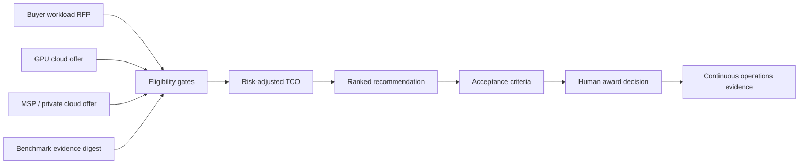

# AI Infrastructure Procurement Platform

**Evidence-driven AI infrastructure procurement for GPU cloud, NVIDIA, Kubernetes, LLM inference, multi-cloud TCO and FinOps.**

[](https://github.com/AAH20/ai-infrastructure-procurement-platform/actions/workflows/ci.yml)
[](LICENSE)

AI Infrastructure Procurement Platform converts workload requirements and supplier claims into an auditable, risk-adjusted recommendation with explicit eligibility failures and contract acceptance criteria.

> The example contains fictional suppliers and modeled economics. The engine is advisory and never awards contracts. Authorized humans own procurement decisions.

The [A2Z AI Capacity Exchange private RFQ pilot](docs/CAPACITY_EXCHANGE.md) adds separate supplier submissions, common-dataset benchmark binding, a private comparison command and a non-authorizing deployment handoff. The bundled bids remain fictional and synthetic; no supplier marketplace or live capacity transaction is claimed.

## Why this exists

Engineering compares latency and throughput. Finance compares price. Security and GRC request controls. Procurement negotiates contracts. When those decisions are disconnected, the cheapest GPU offer can become the most expensive successful workflow. This project evaluates them within one disclosed decision boundary.

## Workflow



## Quick start

```bash
python3 -m venv .venv
. .venv/bin/activate
pip install -e .
aiip examples/retail-ai-rfp.json --as-of 2026-09-06 --output procurement-decision.json
aiip-exchange --rfp examples/exchange-synthetic/rfp.json --offers-dir examples/exchange-synthetic/offers --as-of 2026-09-24 --output /tmp/a2z-capacity-exchange.json
python -m unittest discover -s tests -v
```

## Decision boundary

Hard gates reject residency, latency, quality, availability, memory, required-control, evidence-age and provenance violations. Eligible offers are ranked by monthly contribution margin after delivery cost, amortized migration and buyer-supplied availability, capacity and supplier-risk estimates.

No LLM is required for the award calculation. Agents may gather evidence and draft requirements, but deterministic rules produce the recommendation and humans approve it.

## Compounding evidence graph

```text
workload -> model -> runtime -> hardware -> provider -> region -> price -> SLA -> measured outcome
```

Integrations planned for [LLM Inference Benchmark](https://github.com/AAH20/llm-inference-benchmark), [GPU Inference Platform](https://github.com/AAH20/gpu-inference-platform), OpenTelemetry, OpenCost, DCGM, Terraform and Kubernetes.

## Distribution

- Python library and CLI
- Reusable GitHub Action
- Docker/OCI image
- Secure Kubernetes Job
- Public RFP JSON Schema
- CI-generated decision evidence
- Future MCP/A2A interface and anonymized price-performance index

## Commercial path

The OSS evaluator makes requirements portable. Commercial delivery can include buyer discovery, verified benchmarking, competitive procurement, architecture implementation, continuous supplier assurance and managed AI infrastructure.

## Work with A2Z SOC

Planning a GPU cloud purchase, NVIDIA/Kubernetes platform, cloud-versus-on-premises TCO study or competitive AI infrastructure RFP? [Start a technical engagement at a2zsoc.com](https://a2zsoc.com/).
