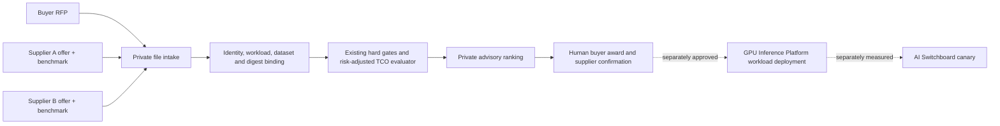

# A2Z AI Capacity Exchange: private RFQ pilot

This repository now implements the first **brokered exchange protocol** on top of its existing AI infrastructure procurement evaluator. A buyer supplies one workload RFP; two to twenty suppliers submit separate JSON offers with benchmark records. The comparison CLI produces a private, deterministic, non-contractual ranking and an advisory deployment handoff. It does not discover suppliers, send bids, reserve capacity, place orders, accept contracts, deploy a model, or change traffic.



## Run the fictional example

```bash
python -m pip install -e .
aiip-exchange --rfp examples/exchange-synthetic/rfp.json \
  --offers-dir examples/exchange-synthetic/offers \
  --as-of 2026-09-24 --output /tmp/a2z-capacity-exchange.json
```

The example has two fictional suppliers and **synthetic** benchmark provenance. The buyer accepts measured evidence only, so the result is `NO_ELIGIBLE_OFFER`. It is not an estimate of real provider prices, GPU performance, or demand. The CLI prints only a short status line; the output file contains confidential-level detail in a real RFQ and must be access-controlled. Do not commit real buyer RFPs or supplier bids.

## Versioned intake contract

The buyer RFP uses the existing `rfp` object: workload ID, monthly volume and revenue assumptions, contract term, allowed regions, TTFT/quality/availability/GPU-memory floors, accepted provenance, evidence age, and required controls. Each `*.json` file in `--offers-dir` has `schema_version=1.0`, the matching `rfp_id`, an `offer` in the existing evaluator format, and a `benchmark` object.

The benchmark must bind to the canonical SHA-256 of the exact buyer RFP, offer ID, supplier, workload, region, runtime, and a **common dataset SHA-256** shared by all bids. It must include at least 20 requests and a successful-workflow count that reconciles to the offered success rate. Its TTFT, availability, GPU memory, observation date and provenance must match the offer's claims. The offer's `evidence.digest` is `sha256:` plus the canonical hash of the benchmark object. This is tamper-evident within the supplied files, **not an identity signature or proof the measurements occurred**.

The existing evaluator then rejects region, quality, latency, availability, memory, controls, stale evidence and unaccepted provenance violations. It ranks eligible offers by buyer-modeled monthly contribution margin after delivery, migration and declared risk costs. Supplier prices, availability and risk probabilities remain declarations. The output always sets `buyer_award_required=true`, `deployment_authorized=false`, and `switchboard_traffic_authorized=false`.

## First real pilot procedure

1. Securely obtain one consenting buyer's representative workload and acceptance dataset. Agree on data residency, testing permissions, a common test harness, required controls, and a private bid deadline.
2. Invite two or three suppliers. Keep their submitted prices and architecture private; do not publish one supplier's terms to another. Run benchmark tests under comparable load and record the exact model, runtime, region, GPU, dataset, price basis and observation window.
3. Reconcile every submission to the shared dataset and RFP. Confirm benchmark provenance out of band; `provenance=measured` is self-declared in this release. Run `aiip-exchange` and review both accepted and rejected offers.
4. Let the buyer negotiate and award separately. Verify final capacity and contractual terms. Only then hand a chosen workload to [GPU Inference Platform](https://github.com/AAH20/gpu-inference-platform) for deployment review; use [AI Switchboard](https://github.com/AAH20/openai-to-vllm-nvidia-nim-migration) for a separately gated cutover.
5. Measure post-deployment accepted-workflow rate, latency, availability, whole-period cost and rollback performance. The first success criterion is one authorized comparison that leads to a real deployment and a completed rollback drill, not the number of listed suppliers.

## OSS and commercial boundary

Keep the RFP/submission schemas, comparison algorithm, synthetic examples, tests and deployment handoff format open. A commercial service can operate confidential supplier intake, verified benchmark execution, buyer discovery, negotiation support, capacity reservation, deployment, service monitoring and support. Do not treat the OSS ranking as a purchase order or promise of savings. A provider marketplace, payments and automated settlement require actual contractual, tax and operations work and are outside this release.
